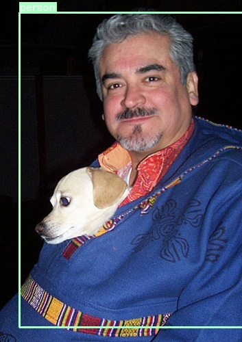
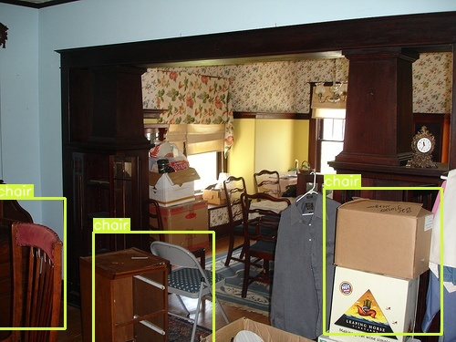
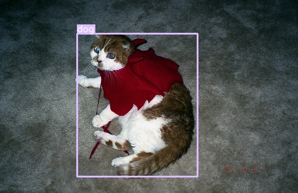
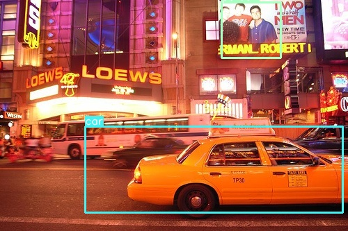
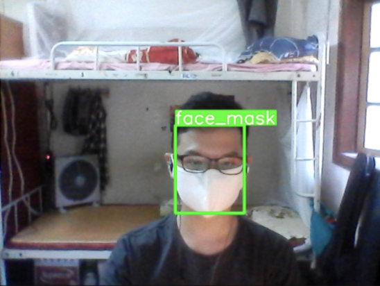
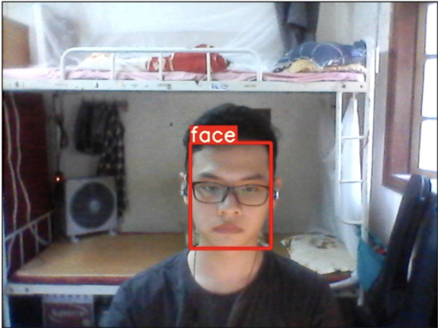
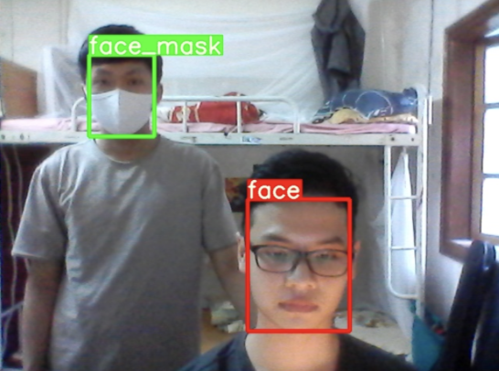

# Single Shot Detector Overview
In this project, we re-implemented a basic approach to Single Shot Detector and Object Production Problem. Single Shot Detector discretizes the output space of bounding boxes into a set of default boxes over different aspect ratios and scales per feature map location. At prediction time, the network generates scores for the presence of each object category in each default box and produces adjustments to the box to better match the object shape. Additionally, the network combines predictions from multiple feature maps with different resolutions to naturally handle objects of various sizes.

This repo re-built the SSD300 model from the scratch, which includes some fundamental files that we need to concern: 
- **train.py** for training SSD model from scractch
- **eval.py** for evaluating pretrained SSD model from a saved checkpoint.
- **detect.py** for object detection demo. 
- other support and setup files for building and implementing m

# Dependencies
* Python 3
* PyTorch 1.6.0
* OpenCV 4.3.0
* albumentations 0.4.6

# About the Dataset
**Single Shot Detector** use the **PASCAL VOC DATASET**, which is spliited into the following sub-datasets:
- [2007 _trainval_](http://host.robots.ox.ac.uk/pascal/VOC/voc2007/VOCtrainval_06-Nov-2007.tar) (460MB)

- [2012 _trainval_](http://host.robots.ox.ac.uk/pascal/VOC/voc2012/VOCtrainval_11-May-2012.tar) (2GB)

- [2007 _test_](http://host.robots.ox.ac.uk/pascal/VOC/voc2007/VOCtest_06-Nov-2007.tar) (451MB) 

The pre-trained model we used was trained on both [2007 _trainval_](http://host.robots.ox.ac.uk/pascal/VOC/voc2007/VOCtrainval_06-Nov-2007.tar) and [2012 _trainval_](http://host.robots.ox.ac.uk/pascal/VOC/voc2012/VOCtrainval_11-May-2012.tar) datasets, and was tested on [2007 _test_](http://host.robots.ox.ac.uk/pascal/VOC/voc2007/VOCtest_06-Nov-2007.tar) dataset

In order to run this code, you should download the data above and put them in the below order: 

data

    |
    |___trainval 
    
    |       |  
    |       |___VOC2007  
    |       |  
    |       |___VOC2012
    |
    |___test
    
            | 
            |___VOC2007
        

# Setup
For easily access and re-implement this code, I recommend to install [Anaconda](https://www.anaconda.com), one of the best toolkit for Data Science and Artifical Intelligence fields. After install Anaconda, create a new enviroment to run this project. I has created both **requirement.txt** and **ssd_env.yaml** for both pip and conda setup. Feel free to create a new enviroment with these files and re-implement the code :D

# Implement 
This code is an end to end on how to build a SSD 300 from scratch. You can choose to train this model from scratch by running the ***train.py** file. Otherwise, you can simple choose to use the pretrained model [here](https://drive.google.com/open?id=1bvJfF6r_zYl2xZEpYXxgb7jLQHFZ01Qe).

Note that this checkpoint should be [loaded directly with PyTorch](https://pytorch.org/docs/stable/torch.html?#torch.load) for evaluation or inference – see below.

Run the **eval.py** file to evaluate the pretrained model.

# Results on VOC2007 test set (mAP)
I made a comparison with other models using difference backbones and here is the result:

| Backbone          | Input Size |   mAP   | Model Size | Download  |
| :---------------: | :---------:| :-----: | :--------: | :-------: |
|  VGG16 by lufficc |     300    |  77.7   |   101 MB   | [model](https://github.com/lufficc/SSD/releases/download/1.2/vgg_ssd300_voc0712.pth)  |
|  VGG16 by me      |     300    |  77.2   |   101 MB   |           |
|  Mobilenet V2     |     320    |  70.5   |   21.9 MB  | [model](https://github.com/ncthuan/single-shot-detection-pytorch/releases/download/0.0/ssd_efficientnet_b3.pt)  |
|  EfficientNet-B3  |     300    |  78.3   |   47.7 MB  | [model](https://github.com/ncthuan/single-shot-detection-pytorch/releases/download/0.0/ssd_mobilenetv2.pt)  |

In the future, we will try to re-implement with other backbones for better comparison :D

# Deployment
This work belong to our another project. The SSD300 model is only one part of this project. In this project, we use the pretrained SSD300 model and retrained it on the dataset of the project. You can view more of this project [here](https://github.com/manhdung20112000/face-mask-detector). After some experiments, we ended up with these result:

[assets_5]: https://github.com/ultralytics/yolov5/releases
[assets_3]: https://github.com/ultralytics/yolov3/releases
[assets_ssd]: https://github.com/amdegroot/ssd.pytorch

Model |size (pixels) |mAPval 0.5:0.95 |mAPval 0.5 |mAPtest 0.5:0.95 |mAPtest 0.5 |Speed V100 (ms) | |params (M) 
---   |---                   |---                     |---                |---                      |---                |---                     |---|---              
[YOLOv5s][assets_5]    |640  |  65.4   |  93.1   |  65.4   |93.2     |**6.3**| |7.3   
[YOLOv5m][assets_5]    |640  |  66.5   |  93.9   |  66.7   |93.7     |7.9    | |21.4  
[YOLOv5l][assets_5]    |640  |**65.8** |**93.9** | 66.9   | 93.8     |12.1   | |47.0  
[YOLOv5x][assets_5]    |640  |  66.5   |  93.5   | **67.3**|**94.0** |  20.7  | |87.7  
| | | | | | || |
[YOLOv3 fastest][assets_3]   |640  | -       | -       | -       | -       | -       | | | - 
[YOLOv3-tiny][assets_3]      |640  |**55.7** |**87.9** |**55.6** |**87.8** |**3.4**  | |8.8  
[YOLOv3-SSP][assets_3]       |640  | -       | -       | -       | -       | -       | |63.0
[SSD300][assets_ssd]           |300  |**54.5** |**85.1** |**52.6** |**86.8** |**3.2**  | | - 
    
The result of SSD300 model is not too good compared to other newest version of **YOLO** family, but it is still acceptable (especially with a model created from 2016). 

# DEMO
Some outputs from VOC2017 test dataset:
  
  
  
  
  
    
Some output from our deployment work:
  
  
  
  
 
